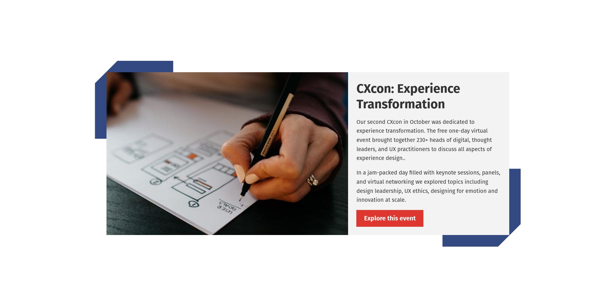
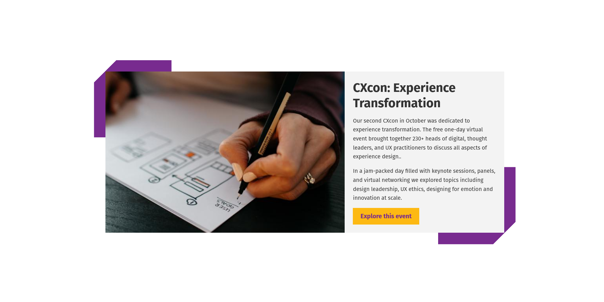
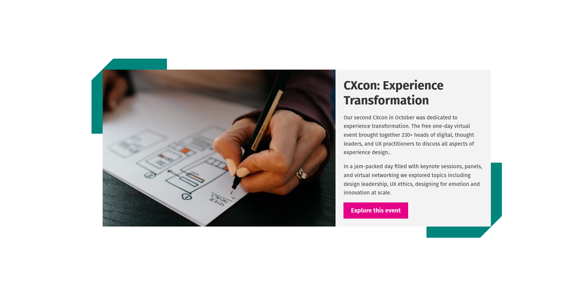

# Inviqa Tailwind CSS example

This is a component from the [Inviqa](https://inviqa.com) website that I recreated as an example for a front-end community of practice session on utility-first CSS.

[The original version](https://play.tailwindcss.com/Yfmw8O5UNN) used a number of `@apply` rules to change the appearance based on a `data-theme` attribute.

After attending the [Pro Tailwind theming workshop](), I moved it into a Next.js application and refactored it to use CSS custom properties, and moved the button and corner styles into a custom plugin.

The `flex-basis` styles have also been moved into a separate plugin, and I've added dark mode support which wasn't in the original version.

## Themes

### Blue

### Purple

### Teal

